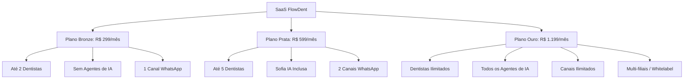

# FlowDent — Requisitos de Negócio (BRD)
**Versão:** 1.0.0  
**Autor:** Principal Product Manager  
**Status:** Aprovado  

---

## 1. Objetivo do Documento
Este documento descreve as necessidades de negócio, regras comerciais e métricas de sucesso financeiro do **FlowDent**. O objetivo é detalhar as regras de monetização, o gerenciamento de contas, cobranças, regras de comissão dos dentistas e a conformidade legal para garantir a sustentabilidade comercial do modelo SaaS.

---

## 2. Modelo de Monetização e Tiers SaaS
A FlowDent opera em um modelo de assinatura recorrente (SaaS) estruturado em três níveis de planos, com precificação baseada no volume de recursos e na quantidade de usuários ativos na clínica.

### Regras de Limites e Cobrança Excedente
*   **Adicionais de Disparo:** Se o envio de mensagens de WhatsApp exceder o limite mensal de disparos do plano, haverá uma taxa variável de R$ 0,05 por mensagem enviada excedente.
*   **Créditos de IA:** O uso de tokens de inteligência artificial é cobrado em créditos adicionais pré-pagos (ex: R$ 50 por 100.000 tokens processados).
*   **Upgrades Automáticos:** Caso a clínica tente cadastrar um profissional acima do limite permitido pelo plano contratado, o sistema deve impedir o cadastro e apresentar o modal de upgrade imediato.

---

## 3. Regras de Negócio Críticas

### RN-01: Regra de Comissionamento de Dentistas
O cálculo de repasse de comissões para profissionais terceiros (parceiros clínicos) deve suportar dois modelos:
*   **Comissão por Faturamento:** O valor é provisionado na conta do dentista apenas quando o paciente realiza o pagamento da parcela correspondente.
*   **Comissão por Execução:** O valor é provisionado assim que o dentista marca o procedimento como "Concluído" no prontuário/odontograma, independentemente de quando o paciente pagar.
*   **Desconto de Taxa Administrativa:** Se o paciente pagou via cartão de crédito ou boleto, a taxa do gateway de pagamento (ex: 2.5% do Pix/Crédito) deve ser subtraída do valor bruto do procedimento antes do cálculo do percentual da comissão do profissional.

### RN-02: Gestão Multi-Filiais (Enterprise Multi-Tenant)
Redes de franquias ou clínicas com múltiplas filiais compartilham o mesmo contrato corporativo, mas requerem isolamento operacional:
*   Os dados financeiros e prontuários devem ser filtrados por filial (`branch_id`).
*   O estoque é individualizado por filial, mas permite transferência de insumos entre elas com controle de movimentação.
*   Profissionais podem trabalhar em múltiplas filiais com agendas independentes.

### RN-03: Ciclo de Vida da Fatura (Contas a Receber)
O fluxo de recebimentos de tratamentos parcelados segue regras rígidas de alerta de inadimplência:
*   **Vencido - 1 Dia:** Envio automático de alerta amigável por WhatsApp com link Pix.
*   **Vencido - 5 Dias:** Acionamento do **Agente de Cobrança IA**, que inicia a negociação interativa via chat.
*   **Vencido - 30 Dias:** Negativação automática do lead no funil do CRM e bloqueio de novos agendamentos eletivos.

### RN-04: Conformidade com a LGPD
Todas as clínicas cadastradas na FlowDent devem estar em conformidade com a Lei Geral de Proteção de Dados (LGPD):
*   **Termo de Consentimento Operacional:** O paciente deve assinar digitalmente o consentimento de tratamento de dados antes de iniciar o prontuário.
*   **Anonimização de Prontuários:** Se o paciente solicitar a exclusão de seus dados, suas informações pessoais são apagadas/anonimizadas, mas o histórico financeiro e os dados epidemiológicos clínicos permanecem mantidos para cumprimento de obrigações contábeis e fiscais do consultório.

---

## 4. Indicadores de Sucesso (KPIs de Negócio)
Para medir a saúde operacional do produto e das clínicas parceiras, a plataforma calcula em tempo real nos dashboards:

*   **CAC (Custo de Aquisição de Clientes):** Total investido em marketing dividido por novos pacientes ativos.
*   **LTV (Lifetime Value):** Receita total média gerada por paciente ao longo do ciclo de vida dele na clínica.
*   **Churn de Assinatura (SaaS):** Taxa de cancelamento de clínicas mensal (meta < 1.8%).
*   **Taxa de Ocupação de Agenda:** Percentual de horas de atendimento ocupadas em relação às horas totais disponíveis dos dentistas.
*   **Taxa de Resolução de IA:** Quantidade de contatos solucionados de forma autônoma pela Sofia em relação ao total de conversas.
