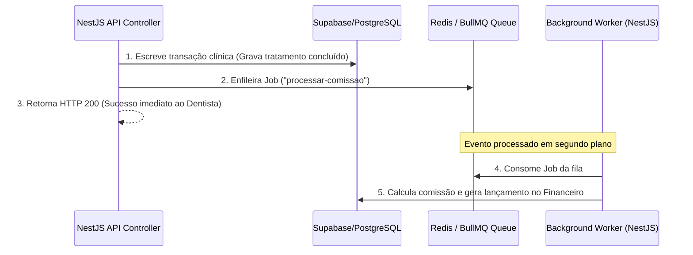

# FlowDent — Arquitetura de Sistemas (Software Architecture)
**Versão:** 1.0.0  
**Autor:** Principal Software Architect  
**Status:** Aprovado  

---

## 1. Objetivo do Documento
Este documento descreve o padrão arquitetural adotado no desenvolvimento do **FlowDent**. O ecossistema é projetado sob os pilares do **Domain-Driven Design (DDD)**, **Clean Architecture (Arquitetura Limpa)** e **Arquitetura Orientada a Eventos (EDA)**, estruturado de modo a permitir um desacoplamento limpo do monolito modular em microsserviços à medida que o volume de tenants crescer.

---

## 2. Visão Geral da Arquitetura (Visão Macroscópica)

A plataforma é dividida em três camadas principais, seguindo o padrão da Arquitetura Hexagonal:

```
  ┌──────────────────────────────────────────────────────────────┐
  │                   Apresentação (Frontend)                    │
  │     Vite React SPA / Next.js Portal (Estilo macOS / Linear)  │
  └──────────────────────────────┬───────────────────────────────┘
                                 │ HTTP / REST / WebSockets
  ┌──────────────────────────────▼───────────────────────────────┐
  │                    Camada de Aplicação                       │
  │          Monolito Modular NestJS (TypeScript)               │
  │  ┌───────────────┐ ┌───────────────┐ ┌────────────────────┐  │
  │  │ CRM Module    │ │ Clinic Module │ │ Automation Module  │  │
  │  └───────────────┘ └───────────────┘ └────────────────────┘  │
  └──────────────────────────────┬───────────────────────────────┘
                                 │
  ┌──────────────────────────────▼───────────────────────────────┐
  │                 Infraestrutura / Serviços                    │
  │  ┌───────────────┐ ┌───────────────┐ ┌────────────────────┐  │
  │  │ Supabase/Postg│ │ Redis/BullMQ  │ │ Vector DB          │  │
  │  └───────────────┘ └───────────────┘ └────────────────────┘  │
  └──────────────────────────────────────────────────────────────┘
```

---

## 3. Padrão de Organização dos Módulos (DDD)
Cada módulo funcional dentro do código NestJS é um domínio de negócio autossuficiente, mapeado em uma pasta própria com a estrutura:

*   **`domain/` (Camada de Domínio - Core):**
    *   **Entities (Entidades):** Regras de negócio primárias e modelos de dados ricos (ex: `Patient.ts`, que possui validações internas como verificar se o CPF é válido).
    *   **Value Objects (Objetos de Valor):** Tipos imutáveis como `Email.ts`, `ToothNumber.ts`.
    *   **Exceptions (Exceções):** Erros específicos do domínio (ex: `ToothAlreadyTreatedException.ts`).
*   **`application/` (Camada de Aplicação - Casos de Uso):**
    *   **Services / Use Cases (Casos de Uso):** Serviços que orquestram a lógica do negócio (ex: `CreateAppointmentUseCase.ts`).
    *   **DTOs (Data Transfer Objects):** Estruturas de entrada/saída de dados.
    *   **CQRS Handlers:** Separação estrita de Comandos (`CreateBudgetCommand`) e Consultas (`GetPatientHistoryQuery`).
*   **`infrastructure/` (Camada de Infraestrutura - Adaptadores):**
    *   **Repositories (Repositórios):** Implementações concretas de persistência acessando Supabase/PostgreSQL (ex: `PrismaPatientRepository.ts`).
    *   **Controllers / Resolvers:** Pontos de entrada HTTP/GraphQL da API.
    *   **Gateways / Clients:** Clientes para serviços terceiros (ex: `EvolutionApiClient.ts`).

---

## 4. CQRS (Command Query Responsibility Segregation)

Para garantir alta performance de leitura e segurança na escrita de dados críticos:

*   **Write Model (Comandos - Modificações de Estado):**
    *   Focam na consistência imediata, validação de regras de negócio complexas e escrita no banco de dados principal.
    *   Disparam eventos de domínio imediatamente após a transação (ex: `AppointmentBookedEvent`).
*   **Read Model (Consultas - Exibição de Dados):**
    *   Buscas no banco são otimizadas. Se necessário, criamos views agregadas ou tabelas de leitura desnormalizadas no Redis.
    *   Para dashboards de BI ou gráficos de faturamento que exigem agregação pesada, são utilizadas **Materialized Views** atualizadas periodicamente via Jobs em segundo plano.

---

## 5. EDA (Arquitetura Orientada a Eventos) com Redis e BullMQ

O FlowDent depende de mensageria assíncrona para não travar a experiência do usuário durante operações pesadas (envio de WhatsApp, processamento de IA, logs, etc.).



### Estrutura Padrão do Evento (Payload JSON)
Todos os eventos trafegados pelas filas devem conter obrigatoriamente metadados de rastreabilidade (Correlation ID) e identificação do Tenant:

```json
{
  "eventId": "evt_719fb42a-a92c-4613-918b-59d4c72836ff",
  "eventType": "appointment.status.changed",
  "tenantId": "clinic-sorriso-perfeito",
  "correlationId": "corr_c882194b-14d2-45e3-8ad4-1c4ba2e316e1",
  "timestamp": "2026-07-03T15:52:00.000Z",
  "data": {
    "appointmentId": "app_21541fb0-d40d-4df6-9d41-410c3b88b0a9",
    "previousStatus": "PENDING",
    "newStatus": "CONFIRMED",
    "updatedBy": "user_pedro-dentista"
  }
}
```

---

## 6. Estratégia "Microservices Ready"
Embora o FlowDent inicie como um **Monolito Modular** para agilizar o time-to-market e facilitar refatorações estruturais, ele está preparado para se transformar em microsserviços em produção avançada:
1.  **Zero Dependências Cruzadas de Banco:** Um módulo não pode acessar tabelas de outro módulo diretamente por meio de queries SQL JOIN. Todo acesso a dados externos deve ocorrer através de interfaces de serviços ou eventos.
2.  **Comunicação por Interfaces:** Se o módulo Financeiro precisa de informações de um Paciente, ele usa o `PatientService` injetado via dependência, facilitando a substituição deste serviço por um cliente gRPC ou REST futuramente.
