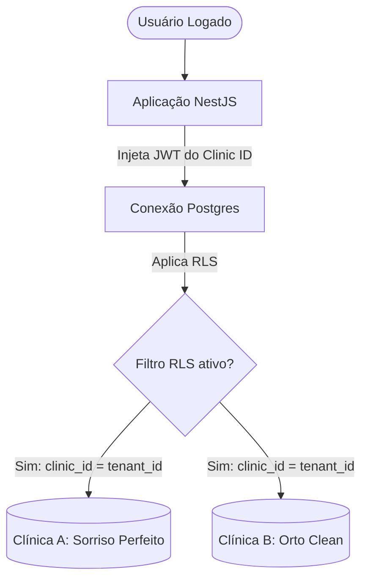

# FlowDent — Arquitetura de Banco de Dados (Database Architecture)
**Versão:** 1.0.0  
**Autor:** Principal Database Architect  
**Status:** Aprovado  

---

## 1. Objetivo do Documento
Este documento descreve a arquitetura física e lógica de banco de dados do **FlowDent**. O banco de dados central é baseado no **PostgreSQL** (fornecido via Supabase), configurado para suportar multitenancy real com isolamento de dados nativo por meio de **Row-Level Security (RLS)**, otimização de consultas por índices estratégicos e suporte a busca semântica por vetores de IA (`pgvector`).

---

## 2. Estratégia de Isolamento Multi-Tenant (Row-Level Security - RLS)

Todas as tabelas do sistema, com exceção das tabelas administrativas globais de controle do SaaS, contêm obrigatoriamente a coluna `clinic_id UUID` referenciando a tabela `clinics(id)`.



### Configuração Padrão do Tenant por Requisição
1.  O cliente faz uma requisição incluindo o token JWT do Supabase contendo a reivindicação (claim) `clinic_id`.
2.  O pooler de conexão (Supavisor) abre a conexão com o Postgres.
3.  A aplicação ou a trigger nativa do Supabase configura o tenant ativo na sessão:
    ```sql
    SET LOCAL app.current_clinic_id = 'clinic-uuid-value';
    ```
4.  A política de segurança de linha (RLS) filtra automaticamente a operação:
    ```sql
    CREATE POLICY tenant_isolation_policy ON public.patients
    FOR ALL
    USING (clinic_id = NULLIF(current_setting('app.current_clinic_id', true), '')::uuid);
    ```

---

## 3. Estratégia de Índices e Performance

Para evitar gargalos de lentidão à medida que o volume de dados das clínicas crescer, todos os relacionamentos possuem chaves estrangeiras explicitamente indexadas.

### Índices B-Tree Estruturais
*   **Índices Compostos:** Criados para colunas frequentemente pesquisadas em conjunto (ex: ordenação de agenda por data/profissional):
    ```sql
    CREATE INDEX idx_appointments_clinic_time ON public.appointments (clinic_id, start_time DESC);
    CREATE INDEX idx_patients_clinic_name ON public.patients (clinic_id, name ASC);
    ```

### Índices GIN para Busca Textual
*   Para buscas textuais de histórico de pacientes e observações clínicas, é utilizado o índice GIN associado à função `to_tsvector` (busca textual de texto completo):
    ```sql
    CREATE INDEX idx_patients_anamnese_gin ON public.patients USING gin (to_tsvector('portuguese', medical_history::text));
    ```

---

## 4. Otimização de Busca Semântica (`pgvector`)

A Sofia e os outros agentes de IA utilizam a extensão `pgvector` para armazenar os embeddings das conversas de WhatsApp e prontuários médicos. Isso permite buscas rápidas por contexto semântico (ex: buscar se o paciente já comentou sobre dor no dente no passado).

```sql
-- Ativar extensão
CREATE EXTENSION IF NOT EXISTS vector;

-- Tabela de memória de longo prazo da IA
CREATE TABLE public.ai_semantic_memory (
    id UUID PRIMARY KEY DEFAULT gen_random_uuid(),
    clinic_id UUID NOT NULL REFERENCES public.clinics(id) ON DELETE CASCADE,
    patient_id UUID REFERENCES public.patients(id) ON DELETE CASCADE,
    content TEXT NOT NULL,
    embedding vector(1536) NOT NULL, -- Tamanho padrão do embedding de IA
    created_at TIMESTAMP WITH TIME ZONE DEFAULT timezone('utc'::text, now()) NOT NULL
);

-- Habilitar RLS
ALTER TABLE public.ai_semantic_memory ENABLE ROW LEVEL SECURITY;

-- Índice para busca por proximidade vetorial (IVFFlat ou HNSW)
CREATE INDEX idx_semantic_memory_hnsw ON public.ai_semantic_memory USING hnsw (embedding vector_cosine_ops);
```

---

## 5. Materialized Views para Dashboards e Business Intelligence

Para evitar sobrecarregar as tabelas transacionais críticas com queries de agregação financeira nos Dashboards, o FlowDent utiliza Materialized Views (Visões Materializadas) atualizadas em lote:

```sql
CREATE MATERIALIZED VIEW public.mv_financial_summary AS
SELECT 
    clinic_id,
    date_trunc('month', date) AS faturamento_mes,
    SUM(CASE WHEN type = 'INCOME' THEN amount ELSE 0 END) AS total_receita,
    SUM(CASE WHEN type = 'EXPENSE' THEN amount ELSE 0 END) AS total_despesa,
    SUM(CASE WHEN type = 'INCOME' THEN amount ELSE -amount END) AS lucro_liquido
FROM public.transactions
GROUP BY clinic_id, date_trunc('month', date);

-- Índice único na Materialized View para permitir atualização concorrente (sem travar leituras)
CREATE UNIQUE INDEX idx_mv_financial_summary_uniq ON public.mv_financial_summary (clinic_id, faturamento_mes);
```

*Nota: Um worker assíncrono executa `REFRESH MATERIALIZED VIEW CONCURRENTLY public.mv_financial_summary` a cada 30 minutos.*

---

## 6. Pooler de Conexões (Supavisor / pgBouncer)
Como a plataforma suporta milhares de clínicas enviando webhooks simultâneos do WhatsApp, o banco de dados deve utilizar o **Supavisor** configurado em **Transaction Mode** (Modo Transação). Isso permite que o sistema gerencie mais de 10.000 conexões virtuais simultâneas mantendo o pool de conexões físicas do PostgreSQL otimizado em torno de 50 a 100 conexões reais estáveis.
