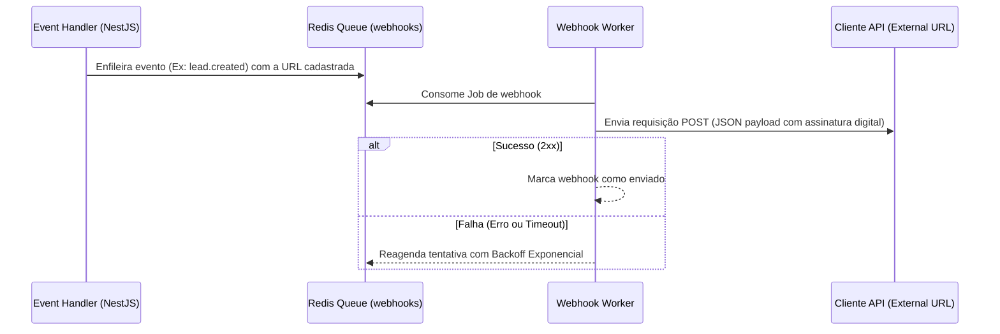

# FlowDent — Arquitetura de APIs (API Architecture)
**Versão:** 1.0.0  
**Autor:** Principal Software Architect & Tech Lead  
**Status:** Aprovado  

---

## 1. Objetivo do Documento
Este documento especifica os padrões de projeto, protocolos de comunicação, segurança e arquitetura de integração das APIs do **FlowDent**. O ecossistema expõe APIs RESTful seguras tanto para consumo do frontend web/mobile nativo quanto para integração de terceiros por meio de chaves de acesso externas (API Keys) em um Developer Portal.

---

## 2. Padrões de Design RESTful

A API segue os princípios clássicos de design RESTful, garantindo verbos HTTP corretos, códigos de retorno padronizados e rotas estruturadas com base nos agregados do DDD.

### Verbos HTTP e Caso de Uso correspondente
*   **`GET`:** Consulta de recursos. Não deve causar efeitos colaterais.
*   **`POST`:** Criação de novos recursos ou execução de comandos de negócio (ex: `POST /crm/leads/simular`).
*   **`PUT`:** Atualização integral de um recurso.
*   **`PATCH`:** Atualização parcial de um recurso (ex: alterar apenas o status de comparecimento de uma consulta).
*   **`DELETE`:** Remoção lógica (Soft Delete) de recursos (adicionando a flag `deleted_at`).

### Respostas HTTP Padronizadas (HTTP Status Codes)
*   **`200 OK`:** Sucesso em operações de leitura ou atualizações.
*   **`201 Created`:** Sucesso na criação de recursos (retorna a URI do novo recurso no cabeçalho `Location`).
*   **`400 Bad Request`:** Erros de validação de dados no lado do cliente (retorna array de erros detalhados).
*   **`401 Unauthorized`:** Token de autenticação expirado ou inválido.
*   **`403 Forbidden`:** Usuário autenticado não possui permissão (cargo) para acessar o recurso (RBAC).
*   **`404 Not Found`:** Recurso pesquisado não existe no banco de dados.
*   **`429 Too Many Requests`:** Bloqueio por estouro do limite de Rate Limiting.
*   **`500 Internal Server Error`:** Erros não tratados do servidor (não exibe o rastreamento da pilha para o cliente em ambiente de produção por segurança).

---

## 3. Segurança, Autenticação e Contexto do Tenant (Multi-Tenant Header)

O cabeçalho das requisições desempenha papel crítico no controle de fluxo e governança dos dados.

### Cabeçalhos de Requisição Padrão
*   **`Authorization`:** Deve conter o token JWT do Supabase Auth (`Bearer <token>`).
*   **`X-Clinic-ID` (Obrigatório para API Keys):** Utilizado apenas em conexões via Developer Portal para identificar a clínica à qual a requisição pertence.

### Middleware de Injeção de Contexto (Context Request Interceptor)
Ao receber qualquer requisição HTTP, o interceptor global do NestJS executa as seguintes etapas:
1.  Valida a assinatura do token JWT.
2.  Extrai o `userId` e o `clinicId` decodificados dos metadados do token.
3.  Injeta essas informações no objeto da requisição, tornando-as acessíveis para os controladores.
4.  Define o parâmetro de sessão do banco de dados `app.current_clinic_id` correspondente ao UUID extraído antes de executar a query.

---

## 4. Controle de Frequência (Rate Limiting)

Para proteger os servidores contra ataques de Negação de Serviço (DoS) e garantir que um único inquilino (Tenant) não monopolize os recursos de processamento (Noisy Neighbor):

*   **API Padrão (Autenticada):** Limite de **600 requisições por minuto** por `clinic_id`.
*   **Developer Portal API (Integração):** Limite de **120 requisições por minuto** por API Key.
*   **Endpoints Críticos (como login/esqueci a senha):** Limite de **5 requisições por minuto** por endereço IP.

*Nota: O controle de taxa é gerenciado em memória ultrarrápida usando **Redis** através de contadores de janela flutuante.*

---

## 5. Webhooks Dispatcher Engine (Disparador de Webhooks Externos)

Quando ocorrem alterações importantes no CRM ou no prontuário, a FlowDent dispara webhooks para os sistemas externos cadastrados pela clínica (como RD Station, ActiveCampaign ou webhooks genéricos do Make/Zapier).

### Assinatura Digital dos Webhooks
Para garantir que o payload não foi adulterado no caminho, cada disparo de webhook inclui no cabeçalho a assinatura digital **`X-FlowDent-Signature`**, gerada calculando o HMAC-SHA256 do payload usando a chave secreta compartilhada da clínica (Webhook Secret Key).
