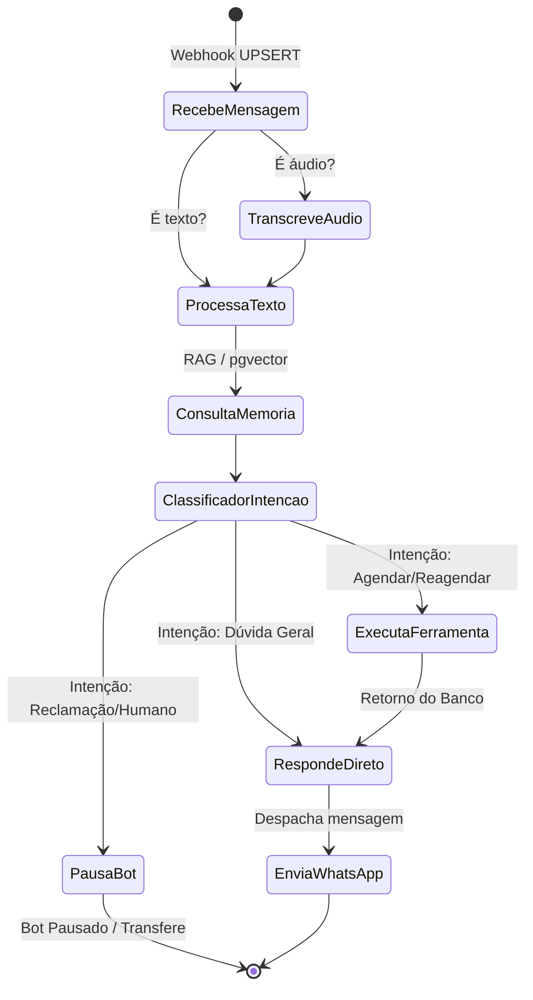

# FlowDent — Arquitetura de Inteligência Artificial (AI Architecture)
**Versão:** 1.0.0  
**Autor:** Principal AI Engineer & Architect  
**Status:** Aprovado  

---

## 1. Objetivo do Documento
Este documento especifica a infraestrutura de Inteligência Artificial, a arquitetura de agentes conversacionais, o design de memória semântica e os fluxos de tomada de decisão (orquestração de ferramentas) do **FlowDent**. Todo o sistema de IA é projetado para operar sobre grafos de estados robustos (usando **LangGraph** em TypeScript) e APIs nativas para respostas e processamento assíncrono.

---

## 2. Seleção de Modelos e Infraestrutura
Para garantir o equilíbrio ideal entre tempo de resposta (latência), custo operacional e inteligência de raciocínio lógico:

*   **Gemini-2.5-Flash (Core Conversational Engine):** Utilizado para todas as conversas diretas em tempo real no WhatsApp. A latência ultrabaixa e a janela de contexto de 1 milhão de tokens o tornam perfeito para o processamento de diálogos rápidos e cheios de nuances.
*   **Gemini-2.5-Pro (Reasoning & Auditing Engine):** Utilizado em segundo plano para relatórios complexos, análise de auditorias clínicas de fichas de pacientes e geração de insights de gestão para o painel administrativo da clínica.
*   **OpenAI Whisper API (Audio Transcription):** Utilizado no webhook do WhatsApp para converter áudios recebidos de pacientes em texto legível para o prompt da Sofia com precisão superior.

---

## 3. Orquestração de Agentes Conversacionais (LangGraph Node Graph)

O fluxo de atendimento da Sofia não é uma árvore de decisões fixa baseada em regras rígidas. Ele é projetado como um **Grafo Orientado a Estados**, onde a IA avalia dinamicamente se precisa chamar banco de dados, consultar a agenda ou transferir para um humano.

---

## 4. Design de Memória da IA (RAG & Long-Term Memory)
Para que a IA soe natural e lembre de detalhes importantes do paciente (ex: *"Lembrar que o paciente tem medo de agulha"* ou *"Paciente prefere atendimentos às quartas-feiras pela manhã"*):

1.  **Memória de Curto Prazo (Short-term context):** Histórico das últimas 20 mensagens trocadas no chat armazenadas e enviadas no array `contents` do Gemini.
2.  **Memória de Longo Prazo Semântica (Long-term semantic RAG):**
    *   Sempre que o paciente menciona preferências ou problemas crônicos, um validador de IA extrai essas informações e as grava na tabela `ai_semantic_memory` na forma de embeddings de 1536 dimensões.
    *   Ao iniciar uma nova interação, o sistema faz uma busca de proximidade por similaridade de cosseno (usando o índice HNSW no postgres com `vector_cosine_ops`) trazendo os 3 fatos mais relevantes sobre aquele paciente para complementar o Prompt do Sistema.

---

## 5. Protocolo de Transição e Handoff Humano (Pausa do Bot)
A IA não deve, em hipótese alguma, insistir em conversas repetitivas caso não entenda o paciente ou quando o paciente se mostrar irritado.

### Regra de Escalonamento Automático
O classificador de sentimentos avalia as interações e ativa o handoff humano (Pausa do Bot) quando:
1.  **Dificuldade de Entendimento:** A IA não consegue solucionar o agendamento em até 3 iterações consecutivas.
2.  **Sentimento Negativo Detectado:** O paciente envia termos que indicam raiva, processos, erro médico ou urgência de dor intensa.
3.  **Pedido Explícito de Atendente:** O paciente envia frases como *"quero falar com uma secretária"*, *"falar com humano"*, etc.

### Mecanismo de Pausa no Banco de Dados
A pausa insere uma flag de bloqueio na tabela `chat_sessions` (`is_bot_paused = true`). Quando ativa, o webhook da Edge Function continuará registrando as mensagens no banco para exibição na tela do atendente, mas pulará qualquer chamada à API do Gemini, deixando a fila livre para respostas manuais da clínica. A recepção humana pode reativar o bot a qualquer momento pelo chat.
