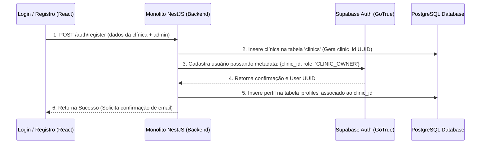

# FlowDent — Autenticação (Authentication Architecture)
**Versão:** 1.0.0  
**Autor:** Tech Lead & Security Engineer  
**Status:** Aprovado  

---

## 1. Objetivo do Documento
Este documento detalha o protocolo e o fluxo de **Autenticação** do ecossistema **FlowDent**. O gerenciamento de identidades, sessões e autenticação de usuários é centralizado no **Supabase Auth** (GoTrue Engine), integrado diretamente ao controle de metadados de tenant (multi-tenancy) e fluxos de renovação de tokens (JWT).

---

## 2. Fluxo de Registro de Clínica & Primeiro Administrador (SaaS Onboarding)

O fluxo de Onboarding cria simultaneamente a clínica, o banco de dados associado e o perfil do administrador principal da conta:



---

## 3. JWT Claims e Estrutura de Token
Após a autenticação bem-sucedida, o Supabase Auth emite um token de acesso em formato JSON Web Token (JWT) assinado com o algoritmo HMAC-SHA256 utilizando a chave privada (`JWT_SECRET`) do projeto.

O payload do JWT do usuário deve conter obrigatoriamente as claims personalizadas que alimentam as políticas de isolamento RLS e cargos (RBAC) do banco de dados:

```json
{
  "iss": "https://rxjwfzknxatoozbuhqtr.supabase.co/auth/v1",
  "sub": "usr_c882194b-14d2-45e3-8ad4-1c4ba2e316e1",
  "aud": "authenticated",
  "exp": 1783120000,
  "role": "authenticated",
  "email": "admin@sorriso.com",
  "app_metadata": {
    "provider": "email",
    "providers": ["email"]
  },
  "user_metadata": {
    "clinic_id": "clinic-sorriso-perfeito-uuid",
    "role": "CLINIC_OWNER",
    "full_name": "Dra. Cláudia Silva"
  }
}
```

*Nota: Durante a injeção do JWT, o middleware de banco do Supabase decodifica o payload e utiliza `user_metadata.clinic_id` para definir as políticas de linha (RLS) das tabelas.*

---

## 4. Recuperação de Acesso (Password Reset Flow)
1.  **Solicitação:** O usuário insere o e-mail na view `/forgot` e clica em recuperar.
2.  **Disparo:** O backend NestJS (ou Supabase Auth) envia um e-mail contendo um link criptografado temporário de uso único (Single-Use Magic Link) com validade de **15 minutos**.
3.  **Redirecionamento:** Ao clicar, o usuário é direcionado para a rota `/reset-password` do frontend, enviando o token de segurança na query da URL.
4.  **Redefinição:** A tela permite que o usuário digite a nova senha. Ao enviar, o frontend aciona `supabase.auth.updateUser({ password: new_password })`, invalidando o token de redefinição anterior e renovando a sessão ativa.

---

## 5. Autenticação de Múltiplos Fatores (MFA)
Para cumprir as diretrizes internacionais de segurança em dados médicos de saúde (HIPAA/LGPD):
*   **MFA TOTP Opcional/Obrigatório:** O administrador da clínica pode configurar o login de duas etapas (MFA) como obrigatório para todos os profissionais.
*   **Configuração:** O usuário escaneia o QR Code gerado pelo app com autenticadores (Google Authenticator, Microsoft Authenticator) gerando chaves temporárias (TOTP).
*   **Validação:** Ao realizar o login inicial com usuário e senha, o sistema identifica que a conta possui MFA ativa e exibe a tela de digitação do token TOTP de 6 dígitos antes de liberar o JWT final de acesso.
