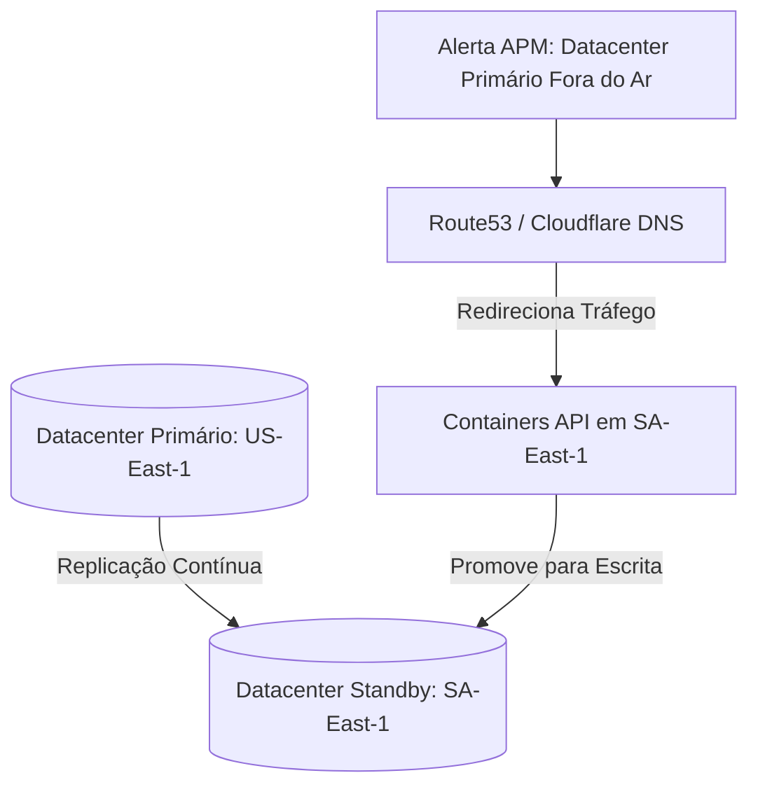

# FlowDent — Backup e Plano de Recuperação de Desastres (Disaster Recovery Runbook)
**Versão:** 1.0.0  
**Autor:** Principal Cloud Infrastructure Architect  
**Status:** Aprovado  

---

## 1. Objetivo do Documento
Este documento define o plano de **Disaster Recovery (DR)** e as políticas de backup e redundância do ecossistema **FlowDent**. O objetivo é garantir que a plataforma consiga se recuperar de falhas catastróficas em datacenters na nuvem ou corrupção acidental de dados com perda mínima e no menor tempo possível (conforme RTO/RPO estabelecidos nos requisitos não funcionais).

---

## 2. Estratégia de Backup do PostgreSQL (Supabase)

O banco de dados transacional é protegido por múltiplas camadas de segurança de backup automatizado:

### 1. Point-in-Time Recovery (PITR - Recuperação Ponto a Ponto)
*   **Funcionamento:** Gravação contínua dos logs de transação (Write-Ahead Logs - WAL) do Postgres em um bucket de armazenamento S3 fisicamente isolado.
*   **Capacidade de Restauração:** Permite restaurar o banco de dados exatamente no estado de qualquer segundo específico nos últimos **7 dias**.
*   **Uso:** Recuperação rápida em caso de exclusão acidental de dados por bugs no código ou erro operacional grave do usuário.

### 2. Backups Lógicos Diários (Logical Dumps)
*   **Funcionamento:** Um dump completo criptografado do banco de dados gerado automaticamente toda madrugada.
*   **Retenção:** Os dumps lógicos são retidos conforme a tabela:
    *   *Dumps Diários:* Mantidos por 7 dias.
    *   *Dumps Semanais:* Mantidos por 4 semanas.
    *   *Dumps Mensais:* Mantidos por 12 meses.
*   **Armazenamento de Destino:** Buckets do AWS S3 configurados com políticas de exclusão protegidas (MFA Delete) e criptografia AES-256 obrigatória.

---

## 3. Redundância de Mídia e Arquivos (File Storage Backup)
Todos os exames de imagem dos pacientes, PDFs de prontuários assinados digitalmente e fotos clínicas carregados pelos dentistas são salvos em buckets do **AWS S3 / Supabase Storage**:

*   **Replicação Multi-Região (Cross-Region Replication):** Os arquivos enviados para a região principal (ex: `us-east-1` Virgínia) são replicados de forma assíncrona pelo provedor em menos de 15 minutos para uma segunda região geograficamente isolada (ex: `sa-east-1` São Paulo).
*   **Versionamento de Objetos (Object Versioning):** O versionamento é ativado por padrão. Se um arquivo for apagado por engano ou sobrescrito por um malware, o sistema mantém as versões anteriores intactas para restauração imediata.

---

## 4. Plano de Recuperação de Desastres (DR / Failover Flow)

Em caso de indisponibilidade total do datacenter primário da nuvem:

1.  **Monitoramento Ativo:** O serviço de roteamento inteligente (AWS Route53 / Cloudflare DNS) monitora a integridade da aplicação principal por meio de *Health Checks* de latência e retorno HTTP.
2.  **Redirecionamento Automático:** Caso o servidor principal fique inacessível por mais de 60 segundos consecutivos, o tráfego de DNS é redirecionado automaticamente (Failover automático) para os servidores reservas hospedados em outra região.
3.  **Promoção do Banco de Dados:** O banco de dados secundário (Read Replica em Hot Standby) é promovido automaticamente a banco de dados primário (leitura e escrita), assumindo as transações com perda quase nula de dados.
4.  **Testes de Simulação Periódicos:** A equipe de infraestrutura realiza simulações semestrais de Disaster Recovery fora do horário comercial para auditar a eficácia do pipeline de failover.
