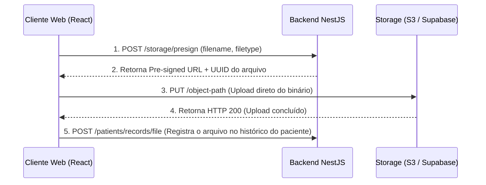

# FlowDent — Gerenciamento de Armazenamento de Arquivos (File Storage)
**Versão:** 1.0.0  
**Autor:** Principal DevOps & Security Architect  
**Status:** Aprovado  

---

## 1. Objetivo do Documento
Este documento especifica a infraestrutura de upload, guarda, segurança, compressão e entrega de arquivos estáticos (exames de raio-X, termos assinados, fotografias clínicas) do **FlowDent**. O produto utiliza serviços de armazenamento de objetos (Object Storage) compatíveis com a API S3 da AWS e Supabase Storage.

---

## 2. Fluxo de Upload Seguro (Pre-Signed URLs)
Para evitar que o backend NestJS sofra sobrecarga de memória processando uploads de arquivos grandes na memória RAM, a FlowDent utiliza uploads diretos do cliente ao Storage por meio de **URLs Assinadas (Pre-Signed URLs)**:

---

## 3. Organização de Diretórios (Folder Structure)
Os arquivos são organizados de forma estrita no bucket seguindo a árvore de pastas multi-tenant:

`storage-bucket/clinics/{clinic_id}/patients/{patient_id}/{document_type}/{year}/{file_uuid}.{extension}`

*   **`clinic_id`:** UUID da clínica. Impede leituras incorretas de outros inquilinos.
*   **`patient_id`:** UUID do paciente dono da mídia.
*   **`document_type`:** Tipos como `exams` (exames), `prescriptions` (receituários), `consents` (termos de consentimento).

---

## 4. Segurança, Antivírus e Acesso Privado
*   **Acesso Privado por Padrão:** Todas as pastas no Storage são marcadas como **Privadas**. Nenhuma imagem ou documento clínico possui URL pública de livre acesso na internet.
*   **Visualização Temporária:** Para renderizar imagens na tela do dentista, o frontend faz uma requisição que gera uma URL assinada de leitura válida por apenas **15 minutos**.
*   **Varredura de Malware (Antivirus check):** Todos os uploads acionam uma função lambda de background (`file-antivirus-scanner`) que roda o utilitário ClamAV. Se o arquivo estiver infectado, ele é movido para uma pasta isolada de quarentena e apagado, gerando um log de segurança.

---

## 5. Compressão e Otimização Dinâmica de Imagens Médicas
Para economizar armazenamento e acelerar a exibição de raios-X e fotografias intraorais em navegadores e celulares:
*   **Conversão para WebP:** Imagens brutas em JPG/PNG ou arquivos grandes DICOM (exames radiológicos) de entrada são convertidas automaticamente para o formato **WebP** com compressão sem perda de qualidade clínica.
*   **Geração de Thumbnails:** O sistema gera miniaturas (Thumbnails) de baixa resolução (ex: 200x200px) para renderização instantânea nas listas de histórico médico, baixando o arquivo de alta resolução apenas quando o dentista clica para expandir no odontograma.
