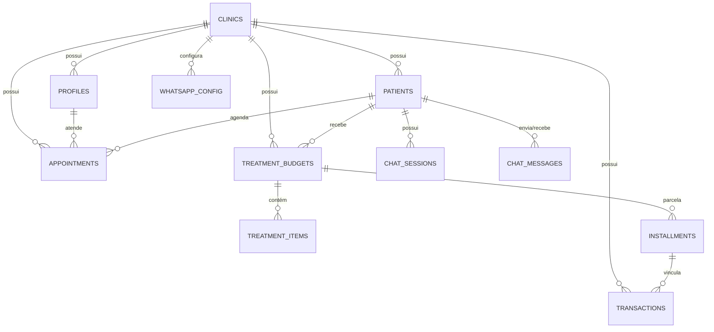

# FlowDent — Diagrama de Entidades e Relacionamentos (ERD)
**Versão:** 1.0.0  
**Autor:** Principal Database Architect  
**Status:** Aprovado  

---

## 1. Objetivo do Documento
Este documento apresenta o modelo relacional lógico e as tabelas principais que constituem o banco de dados do **FlowDent**. O banco de dados é hospedado no **PostgreSQL** e modelado para suportar relações complexas entre clínicas, agendas, prontuários, transações financeiras e histórico de automações de IA.

---

## 2. Diagrama de Relacionamentos (Mermaid)

---

## 3. Dicionário de Dados das Tabelas Core

### 1. Tabela: `clinics` (Inquilino SaaS)
*   **`id`** `UUID` `PRIMARY KEY` (Gerado por `gen_random_uuid()`)
*   **`name`** `VARCHAR(255)` `NOT NULL` (Nome da clínica)
*   **`domain`** `VARCHAR(255)` `UNIQUE` (Domínio whitelabel personalizado)
*   **`subdomain`** `VARCHAR(100)` `UNIQUE` `NOT NULL` (Subdomínio padrão)
*   **`subscription_status`** `VARCHAR(50)` `DEFAULT 'ACTIVE'`
*   **`theme_config`** `JSONB` (Armazena cores e logo)
*   **`created_at`** `TIMESTAMP WITH TIME ZONE` `DEFAULT now()`

### 2. Tabela: `patients` (Pacientes e Leads)
*   **`id`** `UUID` `PRIMARY KEY`
*   **`clinic_id`** `UUID` `NOT NULL` `REFERENCES clinics(id)` (Isolamento RLS)
*   **`name`** `VARCHAR(255)` `NOT NULL`
*   **`phone`** `VARCHAR(50)` `NOT NULL`
*   **`email`** `VARCHAR(255)`
*   **`priority`** `VARCHAR(50)` `DEFAULT 'MEDIUM'`
*   **`stage`** `INTEGER` (Etapa no funil do CRM, `0` a `11`, `NULL` para paciente regular)
*   **`procedure_name`** `VARCHAR(255)` (Interesse principal do lead)
*   **`budget_amount`** `NUMERIC(10,2)` (Orçamento do lead)
*   **`medical_history`** `JSONB` (Histórico clínico completo, exames e odontograma)
*   **`created_at`** `TIMESTAMP WITH TIME ZONE` `DEFAULT now()`

### 3. Tabela: `appointments` (Agenda)
*   **`id`** `UUID` `PRIMARY KEY`
*   **`clinic_id`** `UUID` `NOT NULL` `REFERENCES clinics(id)`
*   **`patient_id`** `UUID` `NOT NULL` `REFERENCES patients(id)`
*   **`doctor_id`** `UUID` `NOT NULL` `REFERENCES profiles(id)`
*   **`start_time`** `TIMESTAMP WITH TIME ZONE` `NOT NULL`
*   **`end_time`** `TIMESTAMP WITH TIME ZONE` `NOT NULL`
*   **`status`** `VARCHAR(50)` `DEFAULT 'PENDING'` (Status: `PENDING`, `CONFIRMED`, `COMPLETED`, `CANCELLED`)
*   **`created_at`** `TIMESTAMP WITH TIME ZONE` `DEFAULT now()`
*   **`updated_at`** `TIMESTAMP WITH TIME ZONE` `DEFAULT now()`
